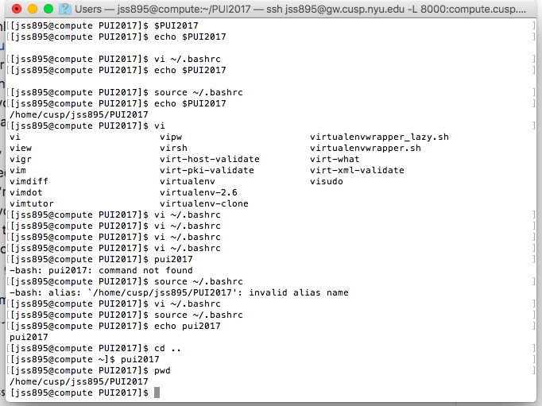

# PUI_jss895

'''In order to set up my environment first I created a Directory called PUI2017, then I created an environmental variable called $PUI2017 that would take me to that directory. Personally I chose the variable to take me to the CUSP data facility in my home directory folder with the given name PUI2017. After doing this, I created an alias pui2017 that would execute the environmental variable $PUI2017. Then I had some issues locating the files in the right folder (given the instructions in the homework) but with some help of the TA and other students I could figure it out. The outcome is having a Github account with the HW1_jss895 folder and in it a README file with this description and the following Screenshots that prove the commands are working.'''

