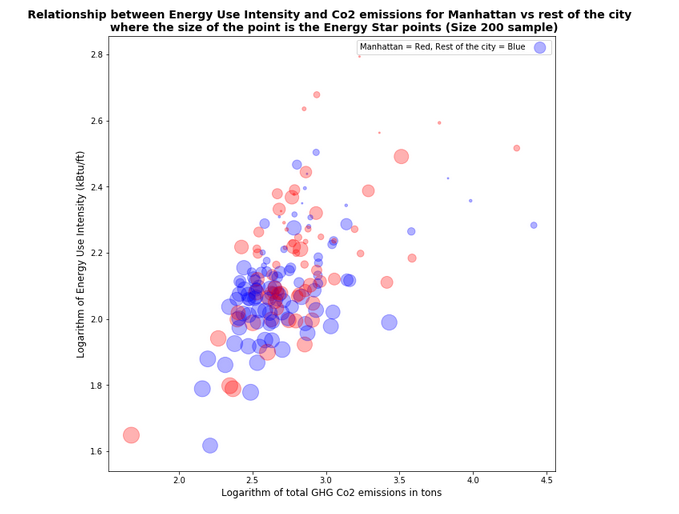

#  Review for jss895
### Reviewed by: ep2247

**Review:**
    The plot is clear and easy to read.  The colors make sense for what is being conveyed in the plot.  When testing for color blindness, you are still able to distinguish all of the colors for each of the three color blind tests that were preformed.  The person did a good job at explaining what the plot was showing in the caption.  One suggestion would be to fix your legend and have Manhattan on one line with a red dot, than have the other boroughs on a seperate line with a blue dot.
