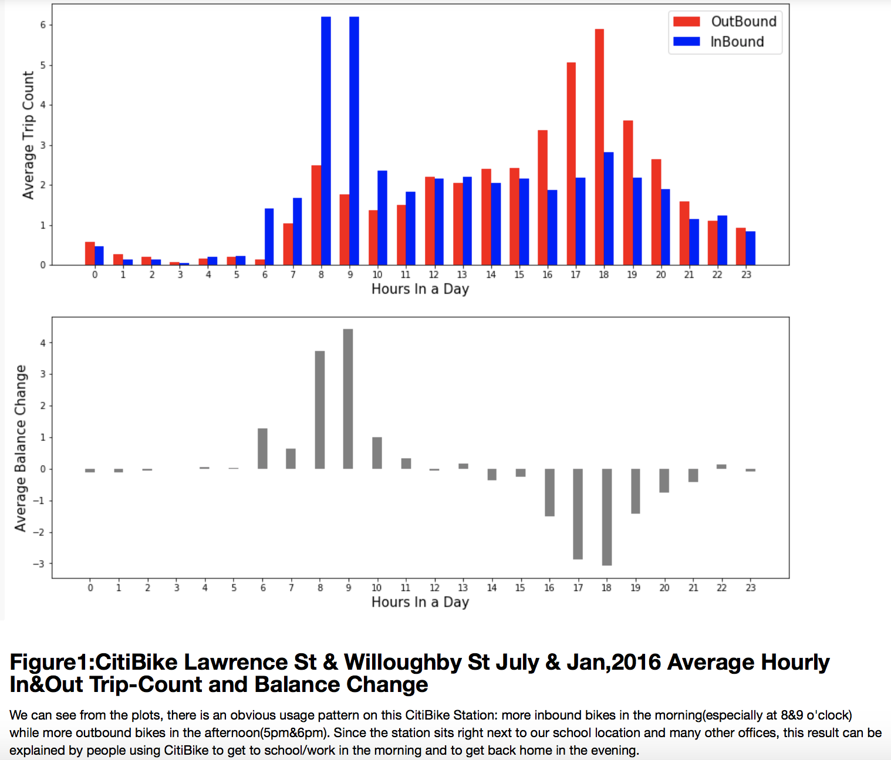

# Comments:

### Color Selection:
I think the colors were selected properly, they present no visualization issues, not even for color blind people.

### Other comments.
I think the graph is very interesting and clearly shows a pattern, although using the word "obvious" may not be appropriate for describing a graph, in the end the pattern will have to be tested statistically, no matter how obvious it is. Finally, I would recommend changing the X axis names, not because it is wrong, just because it is not common to say "Hours in a day", maybe "time of the day" is more familiar to your readers.   
