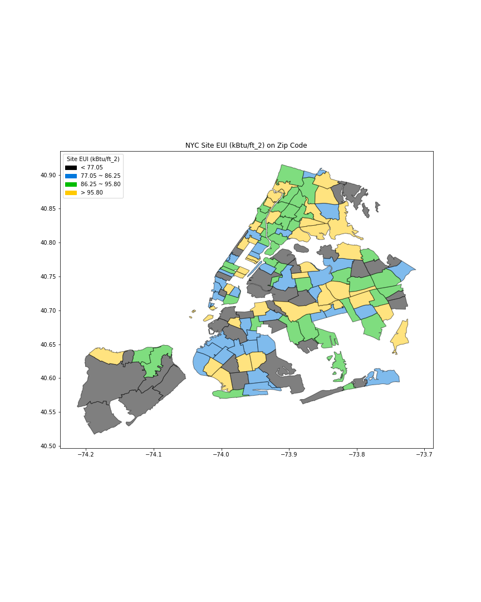

# Comments:

### Color Selection:
Colors were selected correctly, there is no trouble visualizing the graph, not even for colorblind people.

### Other comments.
The graph looks good, it is easy to understand, although the elimination of the "outlier zipcodes" make New York look weird, perhaps generating the shape of the zipcode (without filling it with any color) would be better. This is not graph-related, but in order to understand the information one must explain what Site EUI means. Finally, given that it is a map visualization there is no need to call the latitude and longitude in the X and Y axis (you can map New York using many reference points).
